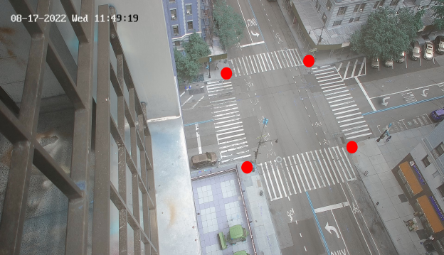
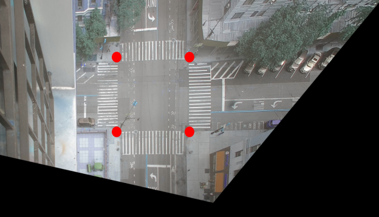
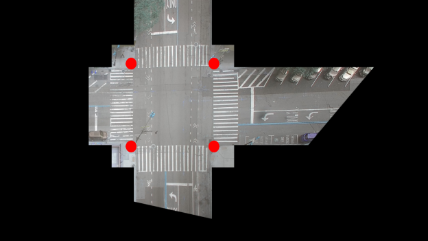
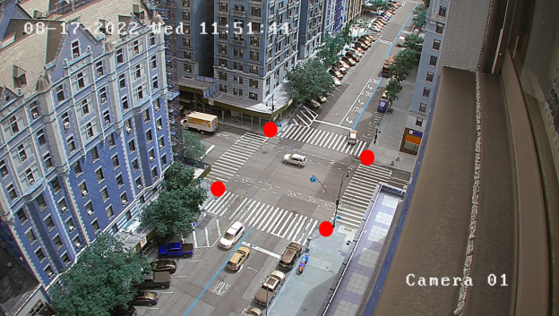
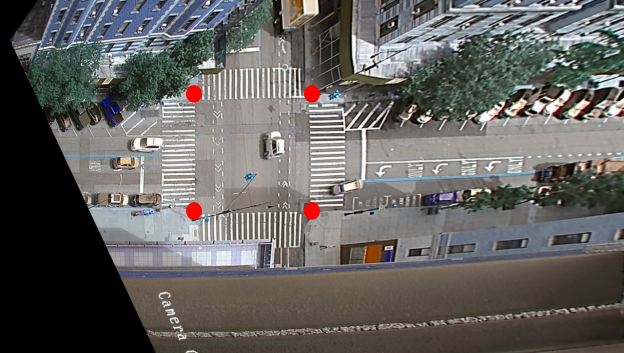
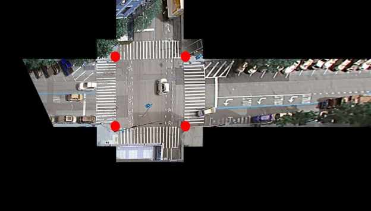

# Implemented a C++ Gstreamer plugin to perform perspective transformation and background subtraction

Note: Refer to the DeepStream SDK documentation for a description of the plugin.


## Pre-requisites
- GStreamer-1.0 Development package
- GStreamer-1.0 Base Plugins Development package
- OpenCV Development package

Instal using `$ sudo apt-get install libgstreamer-plugins-base1.0-dev libgstreamer1.0-dev libopencv-dev`.


## Compiling and installing the plugin
- Export or set in Makefile the appropriate cuda version using CUDA_VER
- Run `$ sudo make`
- Run `$ sudo make install`

NOTE: 
1. To compile the sources, run make with "sudo" or root permission.
2. This plugin contains additional optimized sample which supports batch processing of buffers. Refer to the Makefile for using optimized sample.
3. OpenCV has been deprecated by default, so blur-objects will not work.
   To enable OpenCV in dsexample, set `WITH_OPENCV=1` in the plugin Makefile (/opt/nvidia/deepstream/deepstream/sources/gst-plugins/gst-dsexample/Makefile) and follow compilation and installation instructions present in this README.

Corresponding config file changes (Add the following section). GPU ID might need modification based on the GPU configuration:
```
[ds-example]
enable=1
gpu-id=0
view=1
#Supported memory types for blur-objects are 1 and 3
nvbuf-memory-type=3
```

## Calibration Result
1. Amsterdam Avenue
<p>
  
  
  
</p>

2. 120th Street
<p>
  
  
  
</p>