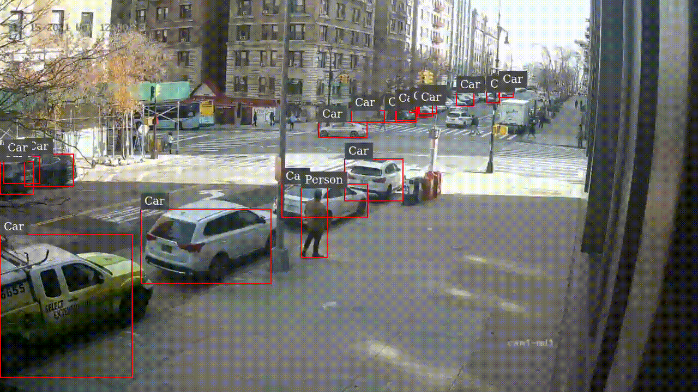
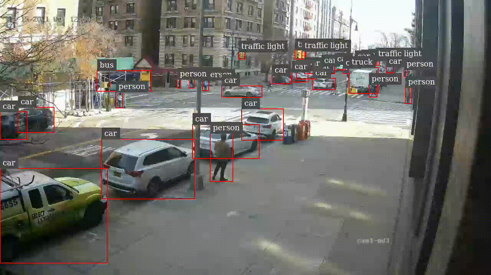
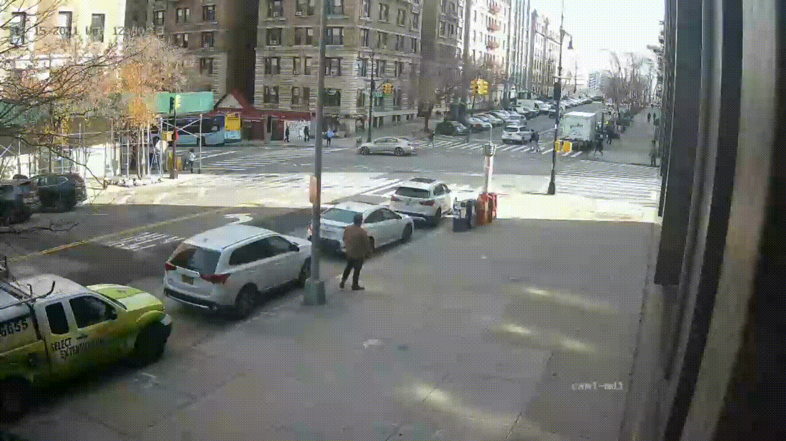
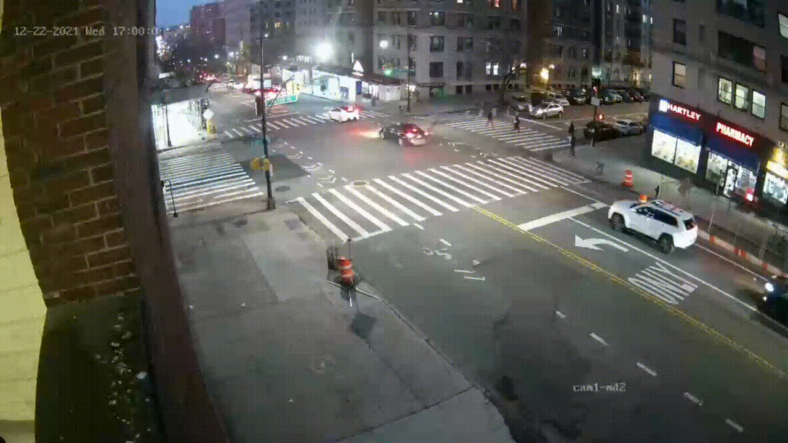

# Deploy YOLOv4 model with DeepStream

## Models

| ID | Model Name  | Size   | Backbone | Dataset| mAP | cfg | weights |
|:---:| :---: | :---: |:---:| :---:| :---:| :---:| :---:| 
| 1 | DetectNet_v2 | 480 × 272 | RestNet-10 | Google OpenImages | 0.79 | - |[LINK](https://api.ngc.nvidia.com/v2/models/nvidia/tao/pretrained_detectnet_v2/versions/resnet10/files/resnet10.hdf5)|
| 2 | YOLOv4 | 512 × 512 | Darknet | COCO | 0.43 | [LINK](https://drive.google.com/open?id=1hSrVqiEbuVewEIVU4cqG-SqJFUNTYmIC) | [LINK](https://drive.google.com/open?id=1L-SO373Udc9tPz5yLkgti5IAXFboVhUt)|
| 3 | YOLOv4 (Alex) | 1440 × 1440 | Darknet | COCO + 1st-floor videos | 0.95 |[LINK](https://drive.google.com/file/d/1ZNNoWI4JTaVziRo-dckX3FushDcQfQEU/view?usp=sharing)|[LINK](https://drive.google.com/file/d/1yJjwijj4sAS_2xX04vM9w6cQtUaej35H/view?usp=sharing)|

## Pre-requisites
1. Install Dependencies
```
$ sudo apt install \
libssl1.1 \
libgstreamer1.0-0 \
gstreamer1.0-tools \
gstreamer1.0-plugins-good \
gstreamer1.0-plugins-bad \
gstreamer1.0-plugins-ugly \
gstreamer1.0-libav \
libgstrtspserver-1.0-0 \
libjansson4 \
libyaml-cpp-dev \
gcc \
make \
git \
python3
```

2. Install NVIDIA driver 510.47.03
    - Download and install NVIDIA driver 510.47.03 from NVIDIA Unix drivers page: `$ wget https://us.download.nvidia.com/XFree86/Linux-x86_64/510.47.03/NVIDIA-Linux-x86_64-510.47.03.run`
    - Run the following commands:
        - `$chmod 755 NVIDIA-Linux-x86_64-510.47.03.run`
        - `$sudo ./NVIDIA-Linux-x86_64-510.47.03.run`

3. Install CUDA Toolkit 11.6.1 (CUDA 11.6 Update 1)
    - Download and install CUDA Toolkit 11.6.1
        - `$ wget https://developer.download.nvidia.com/compute/cuda/11.6.1/local_installers/cuda_11.6.1_510.47.03_linux.run`
        - `$ sudo sh cuda_11.6.1_510.47.03_linux.run`

4. Install TensorRT 8.2.5.1, Run the following commands:
    - `$ sudo rm /etc/apt/sources.list.d/*cuda*`
    - `$ sudo apt-key adv --fetch-keys https://developer.download.nvidia.com/compute/cuda/repos/ubuntu2004/x86_64/3bf863cc.pub`
    - `$ sudo add-apt-repository "deb https://developer.download.nvidia.com/compute/cuda/repos/ubuntu2004/x86_64/ /"`
    - `$ sudo apt-get update`

5. Download TensorRT 8.2 GA Update 4 for Ubuntu 20.04 and CUDA 11.0, 11.1, 11.2, 11.3, 11.4 and 11.5 DEB local repo Package from: https://developer.nvidia.com/compute/machine-learning/tensorrt/secure/8.2.5.1/local_repos/nv-tensorrt-repo-ubuntu2004-cuda11.4-trt8.2.5.1-ga-20220505_1-1_amd64.deb (Note: cURL with a cookie, since Nvidia Developer Login Required)
    - Run the following commands to install TensorRT 8.2.5.1:
        - `$ sudo dpkg -i nv-tensorrt-repo-ubuntu2004-cuda11.4-trt8.2.5.1-ga-20220505_1-1_amd64.deb$ sudo apt-key add /var/nv-tensorrt-repo-ubuntu2004-cuda11.4-trt8.2.5.1-ga-20220505/82307095.pub`
        - `$ sudo apt-get update`
        - `$ sudo apt install tensorrt`

6. Install librdkafka (to enable Kafka protocol adaptor for message broker)
    - Clone the librdkafka repository from GitHub:
        - $ `git clone https://github.com/edenhill/librdkafka.git`
    - Configure and build the library:
        - $ `cd librdkafka`
        - $ `git reset --hard 7101c2310341ab3f4675fc565f64f0967e135a6a`
        - $ `./configure`
        - $ `make`
        - $ `sudo make install`
    - Copy the generated libraries to the deepstream directory:
        - $ `sudo mkdir -p /opt/nvidia/deepstream/deepstream-6.1/lib`
        - $ `sudo cp /usr/local/lib/librdkafka* /opt/nvidia/deepstream/deepstream-6.1/lib`

7. Install the DeepStream SDK by using the DeepStream Debian package
Download the DeepStream 6.1 dGPU Debian package deepstream-6.1_6.1.0-1_amd64.deb: (Note: Use  cURL with a cookie) https://developer.nvidia.com/deepstream-6.1_6.1.0-1_amd64deb
    - Enter the command:
        - `$ sudo apt-get install ./deepstream-6.1_6.1.0-1_amd64.deb`


## Usage
`$ deepstream-app -c configs/deepstream_app_config_realtime_yolov4.txt`.


## Results
1. Detection results of the DetectNet_v2 model.

<p>
  
</p>

2. Detection results of the YOLOv4 model pretrained on COCO.

<p>
  
</p>

3. Detection results of the Alex's YOLOv4 model at daylight.

<p>
  
</p>


4. Detection results of the Alex's YOLOv4 model at nightlight.
<p>
  
</p>
