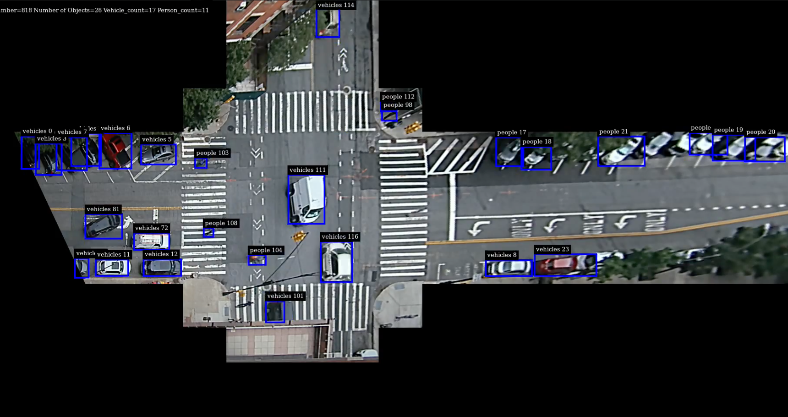

# Build a Python application to realize the real-time detection and tracking pipeline

## Application Workflow
rtsp-source -> srcpad -> sinkpad -> streammux -> nvvidconv -> capsfilter -> nvinfer -> nvtracker -> nvosd ->
queue -> encoder -> parser -> container -> sink -> output-file

## Usage
Run with `$ sudo python3 realtime_main.py`

## Results
1. Detection and tracking results of the YOLOv4 model pretrained on the COCO dataset.

  
  

2. Detection and tracking results of Zhengye’s YOLOv4 model.

  
  

3. Detection and tracking results of Zhengye’s YOLOv4 model after addding GStreamer Plugin.

  
  

  
  

